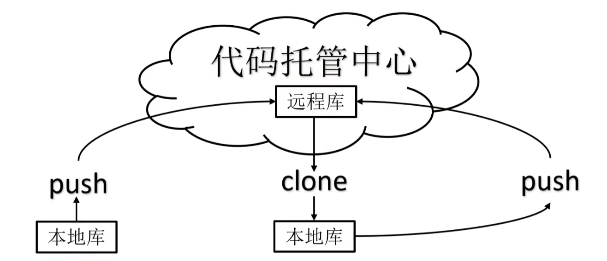
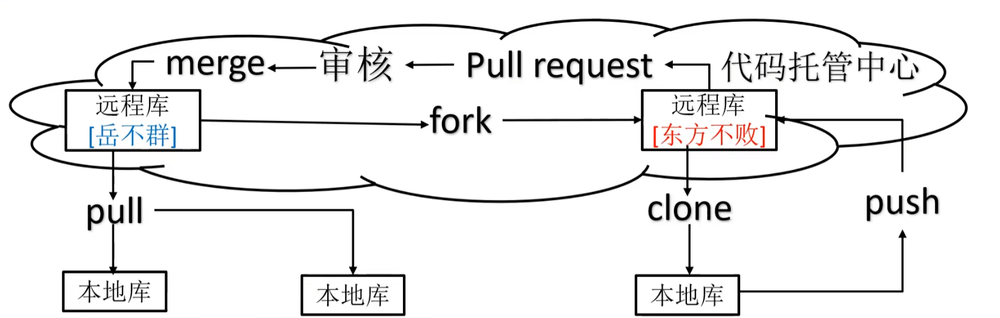

# 用户和邮箱

- 用户签名：hayashisama
- 邮箱：kobayashisora@yeah.net

# Git常用命令

| 命令名称                               | 作用             |
| -------------------------------------- | ---------------- |
| `git config --global user.name 用户名` | 设置用户签名     |
| `git config --global user.email 邮箱`  | 设置用户签名     |
| `git init`                             | 初始化本地仓库   |
| `git status`                           | 查看本地仓库状态 |
| `git add 文件名`                       | 添加到暂存区     |
| `git commit -m "日志信息" 文件名`      | 提交到本地仓库   |
| `git reflog`                           | 查看历史记录     |
| `git log`                              | 查看版本详细信息 |
| `git reset --hard 版本号`              | 版本穿梭         |

# Git分支操作

| 命令名称              | 作用                         |
| --------------------- | ---------------------------- |
| `git branch`          | 创建分支                     |
| `git branch -v`       | 查看分支                     |
| `git checkout 分支名` | 切换分支                     |
| `git merge 分支名`    | 把指定的分支合并到当前分支上 |

# Git团队协作

- 团队内协作

	

- 跨团队协作

	

# GitHub操作

## 仓库远程操作

| 命令名称                           | 作用                                                         |
| ---------------------------------- | ------------------------------------------------------------ |
| `git remote -v`                    | 查看当前所有远程地址别名                                     |
| `git remote add 别名 远程地址`     | 起别名                                                       |
| `git push 别名 分支`               | 推送本地分支上的内容到远程仓库                               |
| `git clone 远程地址`               | 将远程仓库的内容克隆到本地                                   |
| `git pull 远程仓库别名 远程分支名` | 将远程仓库对于分支最新内容拉下来后与当前本地仓库分支直接合并 |

## 创建远程仓库

```shell
# 创建远程仓库和别名
git remote add MyHistoryOfProgress https://github.com/LittleFennel/MyHistoryOfProgress.git

# 看仓库别名
git remote -v
```

## 将代码推送到远程仓库

```shell
git push MyHistoryOfProgress master
```

## 拉取远程库到本地库

```shell
git pull MyHistoryOfProgress master
```

## 克隆远程仓库到本地

```shell
git clone https://github.com/LittleFennel/MyHistoryOfProgress.git 
```

## SSH免密登录

1. 在`C:\Users\user`目录下右键`git bash`生成`.ssh`密钥目录

	```shell
	ssh-keygen -t rsa -C kobayashisora@yeah.net
	```

	然后敲三次回车

2. 将`.ssh`文件夹中的`id_rsa.pub`密钥复制进GitHub的ssh连接中

# IDEA集成Git

## 配置Git忽略文件

1. 创建忽略规则文件`xxxx.ignore`（前缀名随便起，建议是git.ignore）

	这个文件的存放位置原则上哪里都可以，为了便于让~/.gitignore文件引用，建议也放在用户家目录下

	git.ignore文件模板内容如下

	```shell
	# Compile class File
	*.class
	
	# Log File
	.log
	
	# BlueJ Files
	.ctxt
	
	# Mobile Tools for Java (J2ME)
	.mjt.tmp/
	
	# Package Files
	*.jar
	*.war
	*.nar
	*.ear
	*.zip
	*.tar.gz
	*.rar
	
	# Virtual Machine crash logs
	https://www.java.com/en/download/help/error_hotspot.xml
	hs_err_pid*
	
	.classpath
	.project
	.settings
	target
	*.idea
	*.iml
	```

2. 在.gitconfig文件中引用忽略配置文件（此文件在Windows的家目录下）

	```shell
	[user]
		name = hayashi
		email = kobayashisama@yeah.net
	[core]
		excluedesfile = C:/Users/hayashi/git.ignore
	# 这里不能用反斜线
	```
 

